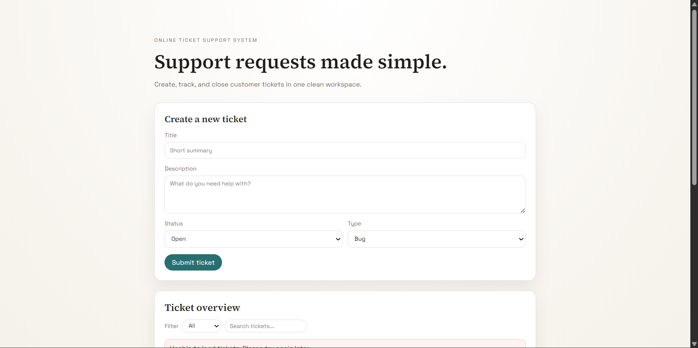
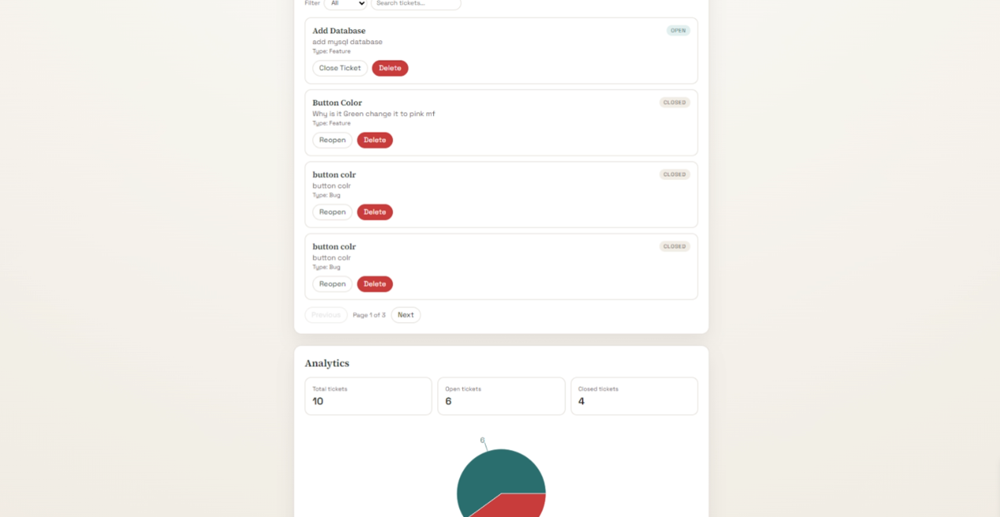

## Online Ticket Support System

A full-stack web application for managing customer support tickets.
Users can create, track, update, search, and delete tickets through a clean and minimal interface.

---

### 🚀 Features

* Create tickets with title, description, status, and type
* View tickets with pagination for better usability
* Filter tickets by status (Open / Closed)
* Search tickets by title or description
* Update ticket status (Open ↔ Closed)
* Delete tickets
* Analytics dashboard with:

  * Total tickets
  * Open tickets
  * Closed tickets
  * Visual representation using charts

---

### 🧰 Tech Stack

#### Frontend

* React (Vite)
* TypeScript
* CSS
* Recharts (for data visualization)

#### Backend

* Java
* Spring Boot (REST API)
* Spring Web

#### Database

* MySQL

---

### ⚙️ Setup

#### Frontend

```bash
cd Frontend
npm install
npm run dev
```

#### Backend

```bash
cd Backend
mvn spring-boot:run
```

---

### 🔗 API Endpoints

Base URL: `http://localhost:8080`

* `GET /tickets` → Fetch all tickets
* `POST /tickets` → Create a new ticket
* `PUT /tickets/{id}` → Update ticket status
* `DELETE /tickets/{id}` → Delete a ticket

---

### 📸 Screenshots




---
